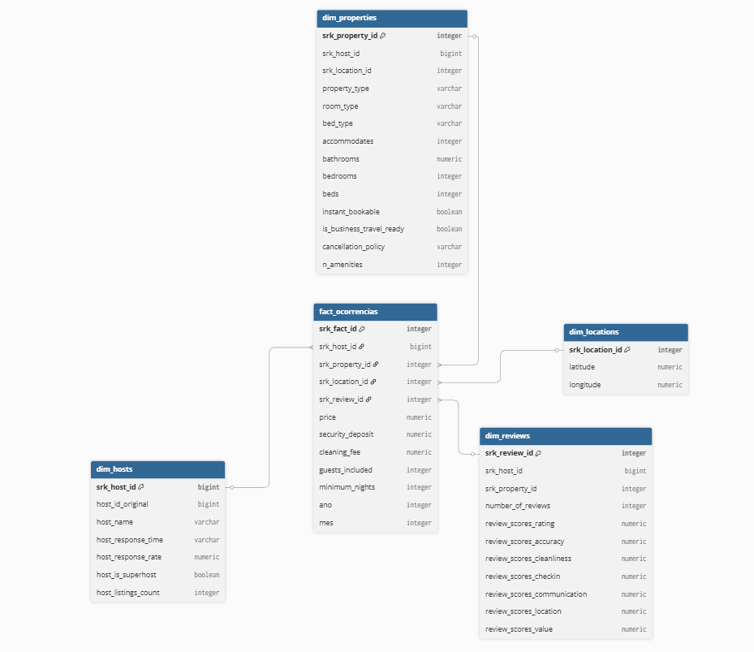

# Modelo Entidade-Relacionamento (MER)

## ENTIDADES (DIMENSÕES)

- dim_hosts  
- dim_locations  
- dim_properties  
- dim_reviews  

## ENTIDADE FATO

- fact_ocorrencias  

## **ATRIBUTOS**

**DIM_HOSTS**: (<ins>srk_host_id</ins>, host_id_original, host_name, host_response_time, host_response_rate, host_is_superhost, host_listings_count)

**DIM_PROPERTIES**: (<ins>srk_property_id</ins>, srk_host_id, srk_location_id, property_type, room_type, bed_type, accommodates, bathrooms, bedrooms, beds, instant_bookable, is_business_travel_ready, cancellation_policy, n_amenities)

**DIM_LOCATIONS**: (<ins>srk_location_id</ins>, latitude, longitude)

**DIM_REVIEWS**: (<ins>srk_review_id</ins>, srk_host_id, srk_property_id, number_of_reviews, review_scores_rating, review_scores_accuracy, review_scores_cleanliness, review_scores_checkin, review_scores_communication, review_scores_location, review_scores_value)

**FACT_OCORRENCIAS**: (<ins>srk_fact_id</ins>, srk_host_id, srk_property_id, srk_location_id, srk_review_id, price, security_deposit, cleaning_fee, guests_included, minimum_nights, ano, mes)

## **RELACIONAMENTOS (Modelo Estrela)**

* **DIM_HOSTS ——< FACT_OCORRENCIAS (N)**
  * Cada host pode estar associado a várias ocorrências na tabela fato.
  * A fact faz referência ao host por meio de `srk_host_id`.

* **DIM_PROPERTIES ——< FACT_OCORRENCIAS (N)**
  * Cada propriedade pode aparecer muitas vezes na tabela fato.
  * A fact referencia a propriedade através de `srk_property_id`.

* **DIM_LOCATIONS ——< FACT_OCORRENCIAS (N)**
  * Uma localização pode estar ligada a várias ocorrências.
  * A fact utiliza `srk_location_id` para ligar cada ocorrência a uma localização específica.

* **DIM_REVIEWS ——< FACT_OCORRENCIAS (N)**
  * Cada conjunto de avaliações pode ser relacionado a várias ocorrências.
  * `srk_review_id` na fact referencia a avaliação registrada na dimensão.

---

| **Entidade**     | **Atributo**                | **Tipo de Dado** | **Tamanho / Formato** | **Nulo** | **Descrição**                                         |
|------------------|-----------------------------|------------------|------------------------|----------|-------------------------------------------------------|
| **DIM_HOSTS**    | srk_host_id                 | BIGINT           | —                      | NÃO      | Surrogate key gerada pela camada GOLD                 |
|                  | host_id_original            | BIGINT           | —                      | SIM      | Identificador original do host no dataset Airbnb      |
|                  | host_name                   | TEXT             | —                      | SIM      | Nome do anfitrião                                     |
|                  | host_response_time          | TEXT             | —                      | SIM      | Tempo médio de resposta do anfitrião                  |
|                  | host_response_rate          | NUMERIC          | —                      | SIM      | Taxa de resposta em porcentagem                       |
|                  | host_is_superhost           | BOOLEAN          | —                      | SIM      | Indica se o anfitrião é Superhost                     |
|                  | host_listings_count         | INT              | —                      | SIM      | Quantidade de imóveis listados pelo anfitrião         |
| **DIM_PROPERTIES** | srk_property_id           | SERIAL           | —                      | NÃO      | Surrogate key da propriedade                          |
|                  | srk_host_id                 | BIGINT           | —                      | SIM      | Surrogate key do host na dim_hosts                    |
|                  | srk_location_id             | INT              | —                      | SIM      | Surrogate key da localização na dim_locations         |
|                  | property_type               | TEXT             | —                      | SIM      | Tipo de propriedade (ex.: casa, apartamento)          |
|                  | room_type                   | TEXT             | —                      | SIM      | Tipo de quarto oferecido                              |
|                  | bed_type                    | TEXT             | —                      | SIM      | Tipo de cama                                         |
|                  | accommodates                | INT              | —                      | SIM      | Capacidade máxima de hóspedes                         |
|                  | bathrooms                   | NUMERIC          | —                      | SIM      | Quantidade de banheiros                               |
|                  | bedrooms                    | INT              | —                      | SIM      | Quantidade de quartos                                 |
|                  | beds                        | INT              | —                      | SIM      | Quantidade de camas                                   |
|                  | instant_bookable            | BOOLEAN          | —                      | SIM      | Indica se possui reserva instantânea                  |
|                  | is_business_travel_ready    | BOOLEAN          | —                      | SIM      | Indica se é adequado para viagens a trabalho          |
|                  | cancellation_policy         | TEXT             | —                      | SIM      | Política de cancelamento                              |
|                  | n_amenities                 | INT              | —                      | SIM      | Quantidade total de amenidades                        |
| **DIM_LOCATIONS** | srk_location_id            | SERIAL           | —                      | NÃO      | Surrogate key da localização                          |
|                  | latitude                    | NUMERIC          | —                      | NÃO      | Coordenada geográfica de latitude                     |
|                  | longitude                   | NUMERIC          | —                      | NÃO      | Coordenada geográfica de longitude                    |
| **DIM_REVIEWS**  | srk_review_id               | SERIAL           | —                      | NÃO      | Surrogate key da avaliação                            |
|                  | srk_host_id                 | BIGINT           | —                      | SIM      | Surrogate key do host na dim_hosts                    |
|                  | srk_property_id             | INT              | —                      | SIM      | Surrogate key da propriedade na dim_properties        |
|                  | number_of_reviews           | INT              | —                      | SIM      | Quantidade total de reviews                           |
|                  | review_scores_rating        | NUMERIC          | —                      | SIM      | Nota geral média                                      |
|                  | review_scores_accuracy      | NUMERIC          | —                      | SIM      | Nota de precisão                                      |
|                  | review_scores_cleanliness   | NUMERIC          | —                      | SIM      | Nota de limpeza                                       |
|                  | review_scores_checkin       | NUMERIC          | —                      | SIM      | Nota de check-in                                      |
|                  | review_scores_communication | NUMERIC          | —                      | SIM      | Nota de comunicação                                   |
|                  | review_scores_location      | NUMERIC          | —                      | SIM      | Nota de localização                                   |
|                  | review_scores_value         | NUMERIC          | —                      | SIM      | Nota de custo-benefício                               |
| **FACT_OCORRENCIAS** | srk_fact_id             | SERIAL           | —                      | NÃO      | Surrogate key da tabela fato                          |
|                  | srk_host_id                 | BIGINT           | —                      | SIM      | Chave estrangeira → dim_hosts                         |
|                  | srk_property_id             | INT              | —                      | SIM      | Chave estrangeira → dim_properties                    |
|                  | srk_location_id             | INT              | —                      | SIM      | Chave estrangeira → dim_locations                     |
|                  | srk_review_id               | INT              | —                      | SIM      | Chave estrangeira → dim_reviews                       |
|                  | price                       | NUMERIC          | —                      | SIM      | Preço da diária                                       |
|                  | security_deposit            | NUMERIC          | —                      | SIM      | Depósito de segurança                                 |
|                  | cleaning_fee                | NUMERIC          | —                      | SIM      | Taxa de limpeza                                       |
|                  | guests_included             | INT              | —                      | SIM      | Número de hóspedes incluídos                          |
|                  | minimum_nights              | INT              | —                      | SIM      | Número mínimo de noites                               |
|                  | ano                         | INT              | —                      | SIM      | Ano da ocorrência                                     |
|                  | mes                         | INT              | —                      | SIM      | Mês da ocorrência                                     |

# Diagrama Entidade Relacionamento (DER)

# Diagrama Lógico de Dados (DLD) 

